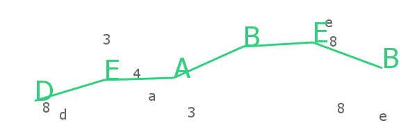

# captcha-canvas
A captcha generator by using node-canvas and canvas-constructor. It is capable to generate captcha like wick. 

#### Captcha Image:


### Features

* Highly customisable
* Easy to use.
* Beginner friedly.

## How to use?

```js
const Captcha = require('captcha-canvas');  //require package here
const fs = require('fs'); //require fs module for saving image in a file
const options = {height: 200, width: 600};  //options for captcha image
const captcha = new Captcha(options); //getting captcha constructor
captcha.captchaText; //returns text of the captcha image.
const buffer = captcha.create(); //returns buffer of the captcha image

fs.writeFileSync('./image.png', buffer); //will create image.png file of the captcha
```

**options.height**: Set height of the captcha image (default value: 200)
**options.width**: Set width of the captcha image (default value: 600)
**options.color**: Set color of the captcha text and trace line (default value: #32cf7e)
**options.font**: Set font for the captcha text (default value: Sans)
**options.characters**: Length of captcha text (default value: 6) [Note: if you set options.text then this option will not be considered]
**options.text**: Text for the captcha image (default value is created randomly by crypto)
**options.noDecoy**: Remove decoy background text by saying it to true. (default value: false)
**options.decoyColor**: Set color for the background text. (default value: #646566)
**options.noTrace**: Remove trace line from the text by setting it to true (default value: false)
**options.traceSize**: Set trace line width. (default value: 3)
**options.fontSize**: Set font size for the captcha. (default value: 40px)

## Examples:

#### Default:

