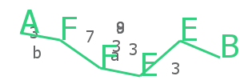

# captcha-canvas
A captcha generator by using node-canvas and canvas-constructor. It is capable to generate captcha like wick. 

#### Captcha Image:



### Features

* Highly customisable
* Easy to use.
* Beginner friedly.

## How to use?

```js
const Captcha = require('captcha-canvas');  //require package here
const fs = require('fs'); //require fs module for saving image in a file
const options = {height: 200, width: 600};  //options for captcha image
const captcha = new Captcha(options); //getting captcha constructor
captcha.captchaText; //returns text of the captcha image.
const buffer = captcha.create(); //returns buffer of the captcha image

fs.writeFileSync('./image.png', buffer); //will create image.png file of the captcha
```

| Options   | Description | Default Value | Type |
|-----------|:-----------:|:-------------:|:----:|
| height    | Set height of the captcha image | 200 | number |
| width | Set width of the captcha image | 600 | number |
| color | Set color of the captcha text and trace line | #32cf7e | color code |
| font | Set font for the captcha text | Comic Sans | canvas font |
| characters* | Length of captcha text | 6 | number |
| text | Text for the captcha image | Random String | String |
| noDecoy | Remove decoy background text by saying it to true. | false | Boolean |
| decoyColor | Set color for the background text. | #646566 | color code |
| noTrace | Remove trace line from the text by setting it to true | false | Boolean |
| traceSize | Set trace line width. | 3 | number |
| fontSize | Set font size for the captcha. | 40px | canvas font size |

 ###### *1 Note: if you set options.text then this option will not be considered

## Examples:

#### Default:


