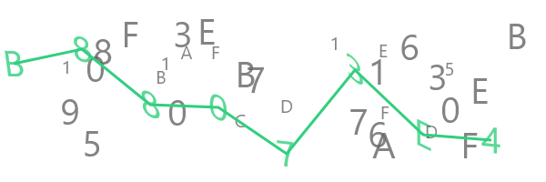

# captcha-canvas

[](https://www.npmjs.com/package/captcha-canvas)
[](https://bundlephobia.com/result?p=captcha-canvas)
[](https://www.npmjs.com/package/captcha-canvas)
[](#contributors-)

A powerful and highly customizable CAPTCHA generator for Node.js applications, built on top of the fast `skia-canvas` rendering engine. Generate secure, visually complex CAPTCHAs that are difficult for bots to solve while remaining accessible to humans.



## Table of Contents

- [Features](#features)
- [Installation](#installation)
- [Quick Start](#quick-start)
- [API Guide](#api-guide)
  - [Simple Functions](#simple-functions)
  - [CaptchaGenerator Class](#captchagenerator-class)
  - [Captcha Class](#captcha-class)
- [Configuration Options](#configuration-options)
- [Examples](#examples)
- [Best Practices](#best-practices)
- [Troubleshooting](#troubleshooting)
- [API Reference](#api-reference)
- [Contributing](#contributing)
- [License](#license)

## Features

- **🎨 Highly Customizable**: Control every aspect including text, fonts, colors, backgrounds, rotation, skewing, and opacity
- **🔒 Security Focused**: Built-in trace lines, decoy characters, and visual distortions to prevent OCR attacks
- **⚡ Dual API Design**: Simple functions for quick generation or advanced classes for complex scenarios
- **🖼️ Background Support**: Add custom background images for enhanced visual complexity
- **📱 Flexible Text**: Support for multi-styled text segments and array-based configurations
- **🚀 Performance**: Async/sync generation methods with efficient canvas rendering
- **📦 Lightweight**: Minimal dependencies with peer dependency architecture
- **🎯 TypeScript Ready**: Full TypeScript support with comprehensive type definitions

## Installation

### Prerequisites

First, install the peer dependency `skia-canvas`:

```bash
npm install skia-canvas
```

### Install captcha-canvas

```bash
npm install captcha-canvas
```

### System Requirements

- Node.js 14+ 
- Platform-specific requirements for `skia-canvas` (see [skia-canvas documentation](https://github.com/samizdatco/skia-canvas))

## Quick Start

### Generate a Simple CAPTCHA

```javascript
const fs = require("fs");
const { createCaptchaSync } = require("captcha-canvas");

// Generate a 300x100 captcha
const { image, text } = createCaptchaSync(300, 100);

fs.writeFileSync("captcha.png", image);
console.log("Captcha text:", text);
```

### Async Generation

```javascript
const { createCaptcha } = require("captcha-canvas");

async function generateCaptcha() {
    const { image, text } = createCaptcha(300, 100);
    const buffer = await image;
    
    fs.writeFileSync("captcha.png", buffer);
    console.log("Captcha text:", text);
}
```

## API Guide

### Simple Functions

Perfect for quick CAPTCHA generation with minimal configuration.

#### `createCaptcha(width, height, options?)`

Generates a CAPTCHA asynchronously.

```javascript
const { createCaptcha } = require("captcha-canvas");

const { image, text } = createCaptcha(400, 150, {
    captcha: {
        text: "HELLO",
        size: 60,
        color: "#2563eb"
    },
    decoy: {
        total: 30,
        opacity: 0.6
    },
    trace: {
        color: "#dc2626",
        size: 4
    }
});
```

#### `createCaptchaSync(width, height, options?)`

Generates a CAPTCHA synchronously (faster, but no background image support).

```javascript
const { createCaptchaSync } = require("captcha-canvas");

const { image, text } = createCaptchaSync(400, 150, {
    captcha: {
        characters: 8,
        size: 50,
        color: "#059669"
    }
});
```

### CaptchaGenerator Class

Provides a fluent interface for advanced CAPTCHA customization with method chaining.

#### Basic Usage

```javascript
const { CaptchaGenerator } = require("captcha-canvas");

const captcha = new CaptchaGenerator()
    .setDimension(200, 500)
    .setCaptcha({
        text: "SECURE123",
        font: "Arial",
        size: 60,
        color: "#1f2937"
    })
    .setTrace({
        color: "#ef4444",
        size: 3
    })
    .setDecoy({
        total: 40,
        opacity: 0.7
    });

// Generate synchronously
const buffer = captcha.generateSync();
fs.writeFileSync("captcha.png", buffer);

// Or generate asynchronously (required for background images)
const asyncBuffer = await captcha.generate();
```

#### Method Chaining Examples

```javascript
// Complete customization
const captcha = new CaptchaGenerator()
    .setDimension(250, 600)
    .setBackground("./background.jpg")
    .setCaptcha({
        text: "CUSTOM",
        font: "Comic Sans MS",
        size: 70,
        color: "#7c3aed",
        skew: true,
        rotate: 15,
        opacity: 0.9
    })
    .setTrace({
        color: "#dc2626",
        size: 5,
        opacity: 0.8
    })
    .setDecoy({
        color: "#6b7280",
        font: "Arial",
        size: 30,
        opacity: 0.4,
        total: 50
    });

const buffer = await captcha.generate();
```

#### Multi-Styled Text (Array Configuration)

Create CAPTCHAs with different styles for each character segment:

```javascript
const captcha = new CaptchaGenerator()
    .setDimension(200, 400)
    .setCaptcha([
        { text: "AB", color: "red", size: 60, font: "Arial" },
        { text: "CD", color: "blue", size: 60, font: "Helvetica" },
        { text: "EF", color: "green", size: 60, font: "Times" }
    ]);

console.log(captcha.text); // "ABCDEF"
```

### Captcha Class

Low-level class for fine-grained control over the rendering process.

```javascript
const { Captcha } = require("captcha-canvas");

const captcha = new Captcha(600, 200, 8); // width, height, characters

// Build the captcha step by step
captcha.addDecoy({ total: 20, size: 40 });
captcha.drawCaptcha({ size: 50, color: "#1e40af" });
captcha.drawTrace({ color: "#dc2626", size: 4 });
captcha.addDecoy({ opacity: 0.3 }); // Add more decoys on top

// Get the result
const buffer = captcha.png;
console.log("Generated text:", captcha.text);
```

## Configuration Options

### Captcha Text Options

```javascript
{
    text: "CUSTOM",        // Custom text (overrides characters)
    characters: 6,         // Number of random characters to generate
    font: "Arial",         // Font family
    size: 60,             // Font size in pixels
    color: "#000000",     // Text color (hex, rgb, or named)
    colors: ["#ff0000", "#00ff00"], // Array of colors (overrides color)
    skew: true,           // Apply random skewing
    rotate: 15,           // Max rotation angle in degrees
    opacity: 0.8          // Text opacity (0-1)
}
```

### Trace Line Options

```javascript
{
    color: "#ff0000",     // Line color
    size: 3,              // Line thickness
    opacity: 1.0          // Line opacity (0-1)
}
```

### Decoy Characters Options

```javascript
{
    color: "#cccccc",     // Decoy color
    font: "Arial",        // Decoy font
    size: 20,             // Decoy size
    opacity: 0.5,         // Decoy opacity (0-1)
    total: 30             // Number of decoy characters
}
```

### Dimension Options

```javascript
captcha.setDimension(height, width);
// Example: captcha.setDimension(150, 400);
```

## Examples

### Basic Web Server Integration

```javascript
const express = require('express');
const { CaptchaGenerator } = require('captcha-canvas');

const app = express();

app.get('/captcha', async (req, res) => {
    const captcha = new CaptchaGenerator()
        .setDimension(100, 300)
        .setCaptcha({ characters: 6 });
    
    const buffer = captcha.generateSync();
    
    // Store captcha.text in session for verification
    req.session.captcha = captcha.text;
    
    res.setHeader('Content-Type', 'image/png');
    res.send(buffer);
});

app.post('/verify', (req, res) => {
    const userInput = req.body.captcha;
    const sessionCaptcha = req.session.captcha;
    
    if (userInput === sessionCaptcha) {
        res.json({ success: true });
    } else {
        res.json({ success: false });
    }
});
```

### Custom Styling Examples

#### High Contrast CAPTCHA

```javascript
const captcha = new CaptchaGenerator()
    .setDimension(120, 350)
    .setCaptcha({
        characters: 5,
        font: "Impact",
        size: 70,
        color: "#ffffff",
        skew: true,
        rotate: 20
    })
    .setTrace({
        color: "#ffffff",
        size: 2,
        opacity: 0.8
    })
    .setDecoy({
        color: "#666666",
        size: 25,
        opacity: 0.3,
        total: 20
    });
```

#### Colorful CAPTCHA

```javascript
const captcha = new CaptchaGenerator()
    .setDimension(150, 400)
    .setCaptcha({
        characters: 6,
        font: "Comic Sans MS",
        size: 60,
        colors: ["#ff6b6b", "#4ecdc4", "#45b7d1", "#96ceb4", "#ffeaa7"],
        skew: true,
        rotate: 25
    })
    .setTrace({
        color: "#2d3436",
        size: 3
    });
```

#### Background Image CAPTCHA

```javascript
const { resolveImage } = require('captcha-canvas');

async function createBackgroundCaptcha() {
    const backgroundImage = await resolveImage('./pattern.jpg');
    
    const captcha = new CaptchaGenerator()
        .setDimension(200, 500)
        .setBackground('./pattern.jpg')
        .setCaptcha({
            text: "SECURE",
            size: 80,
            color: "#ffffff",
            opacity: 0.9
        });
    
    return await captcha.generate();
}
```

### Advanced Multi-Style Example

```javascript
const captcha = new CaptchaGenerator()
    .setDimension(180, 500)
    .setCaptcha([
        { 
            text: "SEC", 
            color: "#e74c3c", 
            size: 70, 
            font: "Impact",
            rotate: 10 
        },
        { 
            text: "URE", 
            color: "#3498db", 
            size: 70, 
            font: "Arial Black",
            rotate: -10 
        }
    ])
    .setTrace({
        color: "#2c3e50",
        size: 4
    })
    .setDecoy({
        total: 35,
        opacity: 0.4
    });

console.log(captcha.text); // "SECURE"
```

## Best Practices

### Security Recommendations

1. **Always validate server-side**: Never trust client-side CAPTCHA validation
2. **Use session storage**: Store the correct answer in server-side sessions
3. **Implement rate limiting**: Prevent brute force attacks
4. **Add expiration**: Set time limits for CAPTCHA validity
5. **Use HTTPS**: Protect CAPTCHA images and validation requests

```javascript
// Example with expiration
app.get('/captcha', (req, res) => {
    const captcha = new CaptchaGenerator().setCaptcha({ characters: 6 });
    const buffer = captcha.generateSync();
    
    req.session.captcha = {
        text: captcha.text,
        expires: Date.now() + 300000 // 5 minutes
    };
    
    res.setHeader('Content-Type', 'image/png');
    res.send(buffer);
});

app.post('/verify', (req, res) => {
    const session = req.session.captcha;
    
    if (!session || Date.now() > session.expires) {
        return res.json({ success: false, error: 'CAPTCHA expired' });
    }
    
    const isValid = req.body.captcha === session.text;
    delete req.session.captcha; // Clear after use
    
    res.json({ success: isValid });
});
```

### Performance Tips

1. **Use sync generation when possible**: Faster for simple CAPTCHAs without backgrounds
2. **Cache background images**: Load background images once and reuse
3. **Optimize dimensions**: Larger images take more processing time
4. **Limit decoy characters**: Too many decoys can impact performance

### Accessibility Considerations

1. **Provide audio alternatives**: Consider implementing audio CAPTCHAs
2. **Use sufficient contrast**: Ensure text is readable for visually impaired users
3. **Offer refresh options**: Allow users to generate new CAPTCHAs
4. **Consider alternative verification**: Implement fallback verification methods

## Troubleshooting

### Common Issues

#### "Cannot find module 'skia-canvas'"

```bash
# Install the peer dependency
npm install skia-canvas
```

#### "Error: Canvas creation failed"

This usually indicates a problem with skia-canvas installation. Try:

```bash
# Reinstall skia-canvas
npm uninstall skia-canvas
npm install skia-canvas

# On some systems, you might need:
npm install skia-canvas --build-from-source
```

#### Background images not working

Ensure you're using the async `generate()` method:

```javascript
// ❌ Wrong - sync method doesn't support backgrounds
captcha.setBackground('./bg.jpg');
const buffer = captcha.generateSync(); // Background ignored

// ✅ Correct - async method supports backgrounds
captcha.setBackground('./bg.jpg');
const buffer = await captcha.generate();
```

#### "Size of text and no. of characters is not matching"

This error occurs when you specify both `text` and `characters` with mismatched lengths:

```javascript
// ❌ Wrong - text length (5) doesn't match characters (6)
captcha.setCaptcha({
    text: "HELLO",
    characters: 6
});

// ✅ Correct - let the library handle character count
captcha.setCaptcha({
    text: "HELLO"
});

// ✅ Or specify only character count for random text
captcha.setCaptcha({
    characters: 6
});
```

### Platform-Specific Issues

#### Windows
- Ensure Visual Studio Build Tools are installed
- Use Node.js 14+ with npm 6+

#### macOS
- Install Xcode Command Line Tools: `xcode-select --install`

#### Linux
- Install required system dependencies for skia-canvas
- See [skia-canvas Linux requirements](https://github.com/samizdatco/skia-canvas#installation)

## API Reference

For complete API documentation with all methods, properties, and type definitions, visit:

**[📚 Full API Documentation](https://captcha-canvas.js.org/v3/)**

### Quick Reference

#### Classes
- `CaptchaGenerator` - High-level fluent interface
- `Captcha` - Low-level canvas manipulation

#### Functions
- `createCaptcha(width, height, options?)` - Async simple generation
- `createCaptchaSync(width, height, options?)` - Sync simple generation
- `resolveImage(path)` - Load images for backgrounds

#### Key Methods
- `.setDimension(height, width)` - Set canvas size
- `.setCaptcha(options)` - Configure text appearance
- `.setTrace(options)` - Configure trace line
- `.setDecoy(options)` - Configure decoy characters
- `.setBackground(image)` - Set background image
- `.generate()` - Generate async (supports backgrounds)
- `.generateSync()` - Generate sync (faster, no backgrounds)

## Contributing

We welcome contributions! Here's how you can help:

### Development Setup

```bash
# Clone the repository
git clone https://github.com/Shashank3736/captcha-canvas.git
cd captcha-canvas

# Install dependencies
npm install

# Build the project
npm run build

# Run examples
npm run example

# Generate documentation
npm run docsgen
```

### Contribution Guidelines

1. **Fork the repository** and create a feature branch
2. **Write tests** for new functionality
3. **Follow TypeScript best practices** and existing code style
4. **Update documentation** for API changes
5. **Test across platforms** when possible
6. **Submit a pull request** with a clear description

### Reporting Issues

When reporting bugs, please include:

- Node.js version
- Operating system
- captcha-canvas version
- Minimal reproduction code
- Error messages and stack traces

Open an issue at: [GitHub Issues](https://github.com/Shashank3736/captcha-canvas/issues)

## License

This project is licensed under the Apache-2.0 License. See the [LICENSE](LICENSE) file for details.

## Contributors ✨

Thanks goes to these wonderful people ([emoji key](https://allcontributors.org/docs/en/emoji-key)):

<!-- ALL-CONTRIBUTORS-LIST:START - Do not remove or modify this section -->
<!-- prettier-ignore-start -->
<!-- markdownlint-disable -->
<table>
  <tr>
    <td align="center"><a href="https://github.com/Shashank3736"><br /><sub><b>Shashank</b></sub></a><br /><a href="#projectManagement-Shashank3736" title="Project Management">📆</a></td>
    <td align="center"><a href="https://github.com/TheDeadCraftPT"><br /><sub><b>TheDeadCraftPT</b></sub></a><br /><a href="https://github.com/Shashank3736/captcha-canvas/issues?q=author%3ATheDeadCraftPT" title="Bug reports">🐛</a></td>
    <td align="center"><a href="https://ichiidev.xyz"><br /><sub><b>IchiiDev</b></sub></a><br /><a href="https://github.com/Shashank3736/captcha-canvas/issues?q=author%3AIchiiDev" title="Bug reports">🐛</a></td>
    <td align="center"><a href="https://t.me/Munn4tic/"><br /><sub><b>Ikramullah</b></sub></a><br /><a href="https://github.com/Shashank3736/captcha-canvas/commits?author=skymunn" title="Documentation">📖</a> <a href="https://github.com/Shashank3736/captcha-canvas/commits?author=skymunn" title="Code">💻</a></td>
    <td align="center"><a href="https://github.com/ryanhex53"><br /><sub><b>ryanhex53</b></sub></a><br /><a href="https://github.com/Shashank3736/captcha-canvas/commits?author=ryanhex53" title="Code">💻</a></td>
  </tr>
</table>

<!-- markdownlint-restore -->
<!-- prettier-ignore-end -->

<!-- ALL-CONTRIBUTORS-LIST:END -->

This project follows the [all-contributors](https://github.com/all-contributors/all-contributors) specification. Contributions of any kind welcome!
