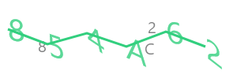

> Note: for v2 doumentation <a href="v2/index.html">click here</a>.

# Getting Started with captcha-canvas v3

To start using this [npm module](https://npmjs.com/package/captcha-canvas). We first need to install it from npm by using command `npm install captcha-canvas`.

### Captcha
**Document:** *<a href="Captcha.html">Click Here</a>*

```js
const { Captcha } = require('captcha-canvas');
const { writeFileSync } = require('fs');
const captcha = new Captcha(); //create a captcha canvas of 100x300.
captcha.async = false //Sync
captcha.addDecoy(); //Add decoy text on captcha canvas.
captcha.drawTrace(); //draw trace lines on captcha canvas.
captcha.drawCaptcha(); //draw captcha text on captcha canvas.

console.log(captcha.text); //log captcha text. 
writeFileSync('captcha.png', captcha.png); //create 'captcha.png' file in your directory.
```
**Result:**



### CaptchaGenerator
**Document**: *<a href="CaptchaGenerator.html">Click here</a>*

```js
const { CaptchaGenerator } = require("captcha-canvas");
const { writeFileSync } = require('fs');

const captcha = new CaptchaGenerator()
.setDimension(150, 450) 
.setCaptcha({text: "CUSTOM05", size: 60, color: "deeppink"})
.setDecoy({opacity: 0.5})
.setTrace({color: "deeppink"});
const buffer = captcha.generateSync(); //everything is optional simply using `new CaptchaGenerator()` will also work.

captcha.text //returns "CUSTOM05"

writeFileSync('captchaGenerator.png', buffer);
```
**Result:**


### createCaptcha
**Documentation:** *<a href="global.html#createCaptcha">Click here</a>*

```js
const { createCaptcha } = require('captcha-canvas');
const { writeFile } = require('fs');

const { image, text } = createCaptcha(300, 100);

(async () => {
	writeFile('docs/captcha/createCaptcha.png', await image, (err) => {
        if(err) {
            console.error(err);
        } else {
            console.log(text);
        }
    });
})();
```
**Result:**


### createCaptchaSync
**Documentation:** *<a href="global.html#createCaptchaSync">Click here</a>*

```js
const { createCaptchaSync } = require('captcha-canvas');
const { writeFileSync } = require('fs');

const { image, text } = createCaptchaSync(300, 100);

writeFileSync('createCaptchaSync.png', image);
console.log(text);
```
**Result:**


## Support
To get help related to this module open an issue in the [github repository](https://github.com/Shashank3736/captcha-canvas). 
